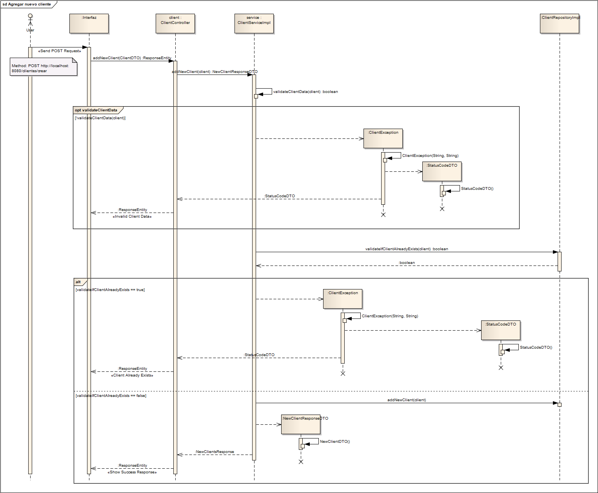
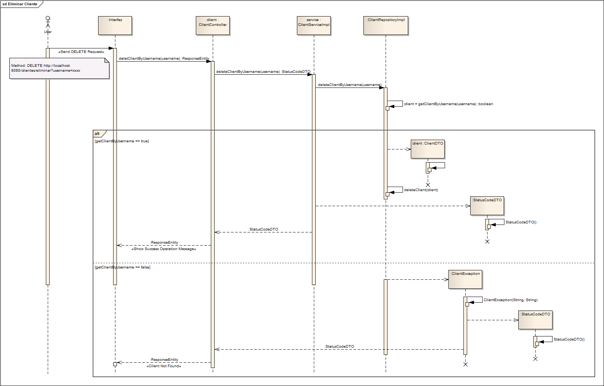
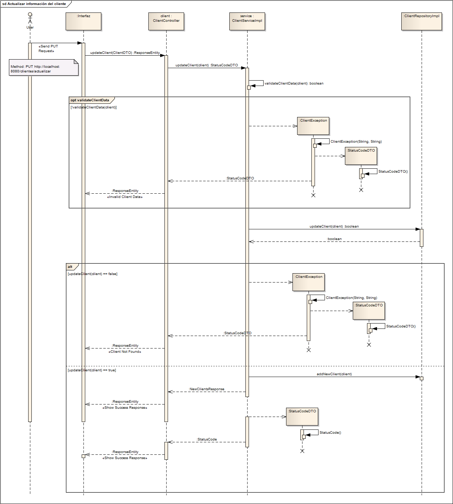
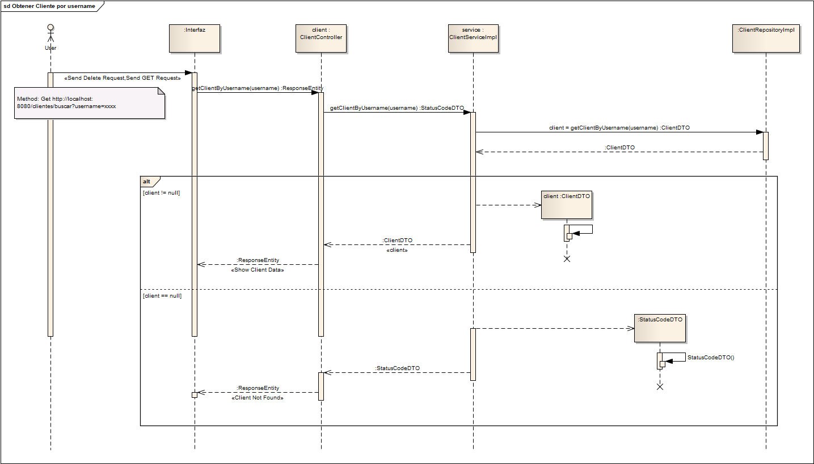
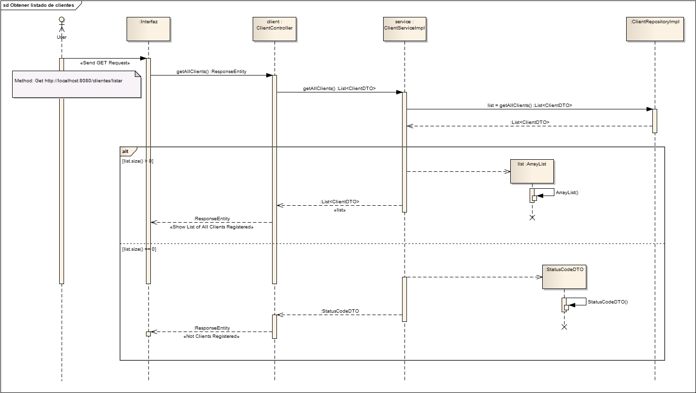

# Clase Quality 03. Desarrollo del ejercicio
## Diagramas de secuencia
Desarrollados para el curso de IT Bootcamp por Cristian David Santoyo Parra

### Ejercicio 1

### Ejercicio 2

### Ejercicio 3

### Ejercicio 4

### Ejercicio 5
